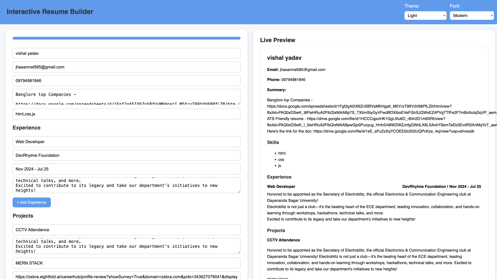
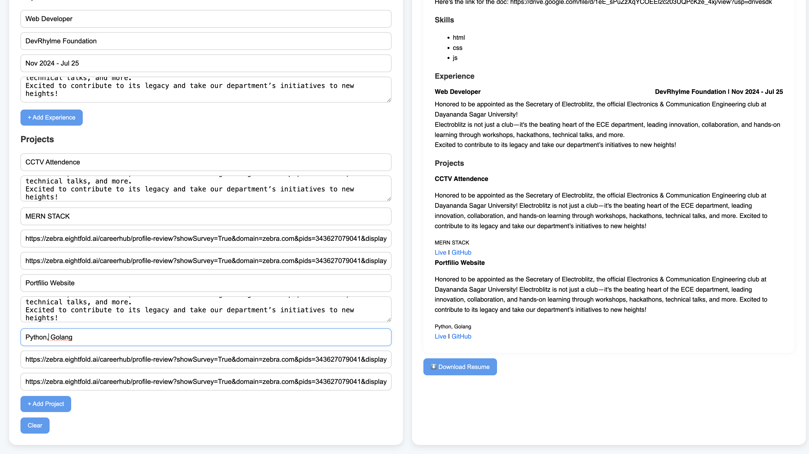

# 🧠 Interactive Resume Builder

An advanced and modern web-based resume builder that allows users to create personalized resumes with live preview, theme customization, drag-and-drop features, and downloadable PDF export.  
No backend required — all done in the browser.

---

## 🔥 Features

- ✍️ **Live Editing** — Real-time preview of your resume
- 🎨 **Themes & Fonts** — Choose between Light, Dark, and Creative themes
- 📚 **Font Styles** — Modern, Classic, Handwritten
- ⬇️ **Download as PDF** — Cleanly formatted resume export
- 🧠 **Auto Save** — Automatically stores data in localStorage
- 🧲 **Drag-and-Drop** — Reorder experience and project sections
- 📶 **Progress Bar** — Tracks form completion live
- 🧹 **Clear All** — Reset form and preview instantly

---

## 📁 File Structure

```
resume-builder/
│
├── index.html         # Main HTML file
├── style.css          # Styling and themes
├── script.js          # JavaScript logic and interactivity
├── README.md          # You're reading this 😄
└── assets/            # (optional) images, icons, logos
```

---

## 🚀 How to Run Locally

### Step 1: Clone the Repository

```bash
git clone https://github.com/your-username/resume-builder.git
cd resume-builder
```

### Step 2: Run the Project

- **Option 1:** Open `index.html` directly in your browser (double-click or right-click → Open with)
- **Option 2:** Use VS Code Live Server extension  
- **Option 3:** Run a Python HTTP server

```bash
python -m http.server
```

---

## 🧰 Built With

- **HTML5** — Markup and layout
- **CSS3** — Styling and animations
- **JavaScript (Vanilla)** — Functionality and logic

---

## 🔌 External Libraries Used

- [html2pdf.js](https://github.com/eKoopmans/html2pdf) — Convert preview to downloadable PDF
- [Sortable.js](https://github.com/SortableJS/Sortable) — Drag-and-drop support

---

## 🧠 How to Use

1. Enter your personal details, skills, experience, and projects.
2. Select your theme and font style from the dropdown.
3. Add more **Experience** or **Project** sections dynamically.
4. Reorder blocks using drag-and-drop.
5. Your inputs are auto-saved every few seconds.
6. Use **Live Preview** to check resume formatting.
7. Click **⬇️ Download Resume** to generate a PDF.
8. Use the **Progress Bar** to track form completion.

---

## 📸 Preview Screenshot

💡 *(Add a screenshot of your project here)*  
_Example placeholder:_




---

## ✅ Future Enhancements

- Google Drive / OneDrive Sync
- Theme preview thumbnails
- Resume templates / layout variations
- Export to DOCX
- AI-based content recommendations

---

## ⚖️ License

This project is licensed under the **MIT License** — feel free to use and modify.

---

## 👤 Author

**Rimjhim Mishra**  
🎓 *B.Tech in Computer Science)*  
🏫 *SR Institute of Management and Technology*  
📬 *mishrarimjhim.009@gmail.com*  

🔗 [LinkedIn](https://www.linkedin.com/in/rimjhim-mishra-8771632a3/) | [GitHub](https://github.com/mishraji654)

---
